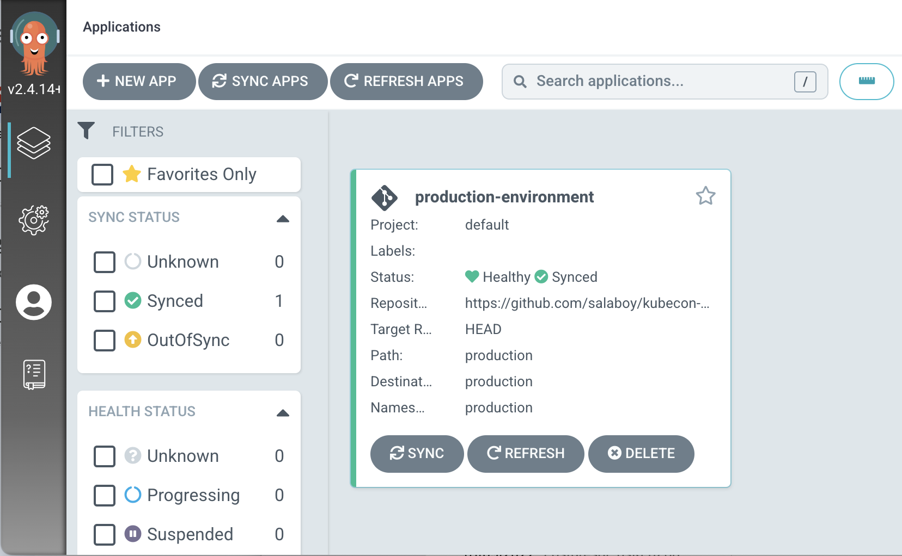
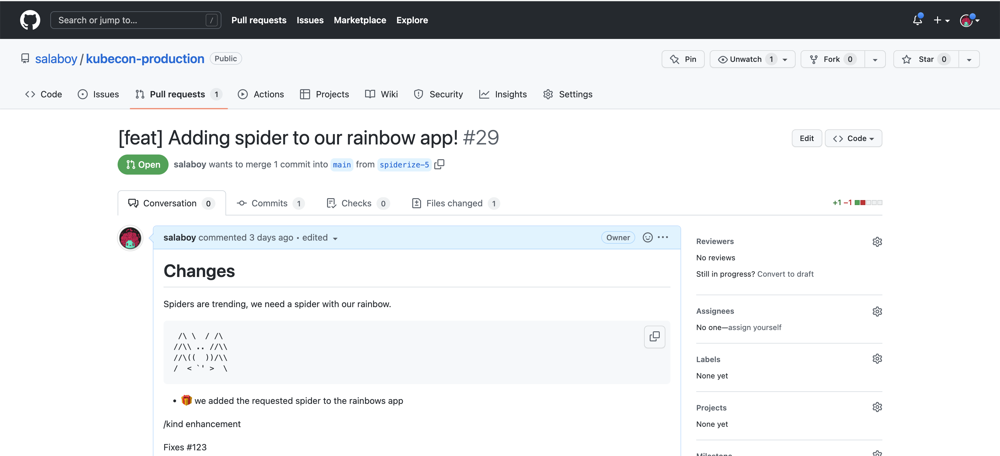
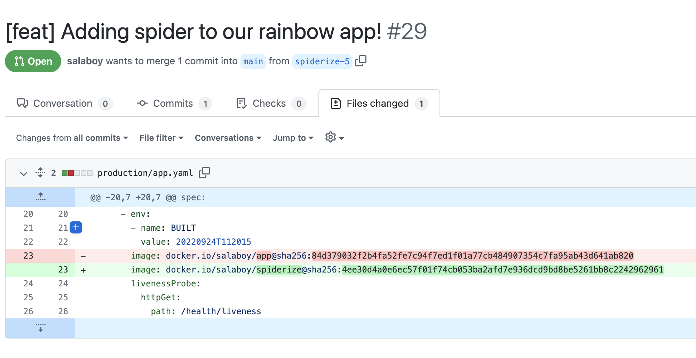

# Kubecon North America 2022 :: Keynote Demo


In this step-by-step tutorial, you will install and configure a set of open source projects to create an Internal Development Platform (IDP) for a fictitious company. [You can read more about the use case here](use-case.md).  

## Who are we?

- [Mauricio "@salaboy" Salatino](https://twitter.com/salaboy): Mauricio is a OSS Software Engineer at [Diagrid](https://diagrid.io), where he works at the [Dapr OSS Project](https://dapr.io) and [Knative OSS](https://knative.dev) project as the Knative Functions working group co-lead. Mauricio writes in his blog [salaboy.com](https://salaboy.com) and  published a book with Maning [Platform Engineering on Kubernetes - Manning 2023](http://mng.bz/jjKP) that you get here with a 40% discount by using the the code: **salatino40**  
- [Whitney Lee](https://twitter.com/wiggitywhitney): Whitney is a Staff Technical Advocate for [VMware Tanzu](https://via.vmw.com/LaUJHx), and she enjoys understanding and using tools in the cloud native landscape. Creative and driven, [Whitney recently pivoted from an art-related career to one in tech](https://blogs.vmware.com/opensource/2022/10/20/inspirational-women-in-open-source-spotlight-on-whitney-lee/). She is active in the open source community, especially around CNCF projects focused on developer productivity. You can catch her lightboard streaming show [⚡️ Enlightning](https://via.vmw.com/EkDb) on Tanzu.TV. And not only does she rock at tech - she literally has toured playing in the band [Mutual Benefit](https://youtu.be/imjD7ogpKCs) on keyboards and vocals. 


## Intro

The tutorial section ['Requesting a New Environment'](#requesting-a-new-environment) uses [Crossplane](https://crossplane.io), the [Crossplane Helm Provider](https://github.com/crossplane-contrib/provider-helm) and [VCluster](https://vcluster.com) to enable developers to request new environments in which to do their work. The ['Creating and Deploying a Function'](#creating-and-deploying-a-function) section uses [Knative Serving](https://knative.dev) and [Knative Functions](https://github.com/knative/func) to create and deploy a function into the environment that we created. Finally, the ['Our Function Goes to Production](#our-function-goes-to-production) section uses [ArgoCD](https://argoproj.github.io/cd) to promote the function that we have created to the production environment without requiring any teams to interact with the production cluster manually. 

You can read more about these projects and how they can be combined to build platforms in the  blog posts titled: **The Challenges of Building Platforms [1](https://salaboy.com/2022/09/29/the-challenges-of-platform-building-on-top-of-kubernetes-1-4/), [2](https://salaboy.com/2022/10/03/the-challenges-of-platform-building-on-top-of-kubernetes-2-4/), [3](https://salaboy.com/2022/10/17/the-challenges-of-platform-building-on-top-of-kubernetes-3-4/) and [4 coming soon]()**.

This step-by-step tutorial is divided into 3 sections:
- [Requesting a New Environment](#requesting-a-new-environment)
- [Creating and Deploying a Function](#requesting-a-new-environment)
- [Our Function Goes to Production](#our-function-goes-to-production)

> But before you jump into the demos, you need to make sure that you follow the [Prerequisites and Installation Guide](prerequisites.md).


## Requesting a New Environment 

To use the platform to request a new `Environment`, you need to create a new `Environment` resource like this one: 

```arachnid-env.yaml
apiVersion: salaboy.com/v1alpha1
kind: Environment
metadata:
  name: arachnid-env
spec:
  compositionSelector:
    matchLabels:
      type: development
  parameters: 
    spidersDatabase: true
    cacheEnabled: true
    secure: true
    
```

Next, send it to the Platform APIs using `kubectl`:

```
kubectl apply -f arachnid-env.yaml
```

You can now treat your created `Environment` resource as any other Kubernetes resource. You can list them using `kubectl get environments`, or even `kubectl describe` them to see more details. 

Because we are using VCluster, you can go back and check if there is now a new VCluster with this command:

```
vcluster list 
```

Notice the VCluster is there, but it is not connected.


We can now create a function and deploy it to our freshly created **Arachnid Environment**.

## Creating and Deploying a Function

Now that we have an environment let's create and deploy a function to it.

Before creating a function, let's make sure that we are connected to our **Arachnid Environment**: 

On Linux with `bash`:
```
vcluster connect arachnid-env --server https://localhost:8443 -- bash
```
or on Mac OSX with `zsh`:

```
vcluster connect arachnid-env --server https://localhost:8443 -- zsh
```

We just used VCluster to connect to our `Environment`, therefor now we can use `kubectl` as usual (try `kubectl get namespaces` to check that you are in a different cluster). But instead of using `kubectl`, we will use the [Knative Functions](https://github.com/knative/func) CLI to enable our developers to create functions without the need of writing Dockerfiles or YAML files. 

First let's create a new empty directory for the function:
```
mkdir functions/spiderize/
cd functions/spiderize/
```
Now we can use `func create` to scaffold a function using the `Go` programming language and a template called `spiders` that was defined inside the template repository [https://github.com/salaboy/func](https://github.com/salaboy/func)
```
func create -r https://github.com/salaboy/func -l go -t spiders
```

Feel free to open the function using your favourite IDE or editor.

We can deploy this function to our development environment by running: 

```
func deploy -v --registry docker.io/<YOUR DOCKERHUB USER>
```

Where the `--registry` flag is used to specify where to publish our container image. This is required to make sure that the target cluster can access the function's container image.

Before the command ends, it gives us the URL of where the function is running. Now we can copy the URL and open it in our browser. It should look like this: 

[http://spiderize-x-default-x-arachnid-env.arachnid-env.127.0.0.1.sslip.io](http://spiderize-x-default-x-arachnid-env.arachnid-env.127.0.0.1.sslip.io)


Voila! You have just created and deployed a function to the `arachnid-environment`. 
You are a trailblazer in the rainbows industry!


## Our Function Goes to Production

We have configured the production cluster to use [ArgoCD to synchronize the configuration located into a GitHub repository to our production namespace](https://github.com/salaboy/kubecon-na-keynote/blob/main/platform-cluster.md#configure-production-environment-namespace). 



To deploy the function that we have just created to our production environment, we send a pull request to our production environment [GitHub repository](https://github.com/salaboy/kubecon-production). This pull request contains the configuration required to updated our rainbows-as-a-service application. 
 
By sending a pull request with the changes to the [`app.yaml`](https://github.com/salaboy/kubecon-production/blob/main/production/app.yaml) file, we can enable automated tests on the platform to check if the changes are production-ready. Once the changes are validated, the pull request can be merged. 

[Check this example pull request that changes the configuration of the application to use our new function image](https://github.com/salaboy/kubecon-production/pull/24/files). 



Once the changes are merged into the `main` branch of our repository, ArgoCD will sync these configuration changes. This causes our function to be deployed and automatically available for our users to interact with. 



We have used the following repository to host our production environment configuration: 
[https://github.com/salaboy/kubecon-production](https://github.com/salaboy/kubecon-production)

We recommend that you fork this repository, or create a new one and copy the contents. 

If you push new configuration changes inside the `/production` directory, you can use ArgoCD to sync these changes to the production cluster, without the need of using `kubectl` to the production namespace directly. 

Once the function is synced by ArgoCD you should be able to point your browser to [https://app.production.127.0.0.1.sslip.io/](https://app.production.127.0.0.1.sslip.io/) to see the new version of the application up and running! 

**Our change made it to production!**


# Resources and Links

- [Platform Engineering on Kubernetes - Manning 2023](http://mng.bz/jjKP)
- [⚡️ Enlightning](https://tanzu.vmware.com/developer/tv/enlightning/)
  - [What is ArgoCD?](https://via.vmw.com/ArgoCD)
  - [Empower Your Dev Teams with Virtual Clusters!](https://via.vmw.com/VCluster)
  - [What Are Cloud Native Buildpacks and How Do They Work?](https://via.vmw.com/Buildpacks)
  - [Crossplane: Control Plane of Control Planes](https://via.vmw.com/Crossplane)
  - [What Is Knative Serving?](https://via.vmw.com/KnativeServing)
  - [What is Tekton?](https://via.vmw.com/Tekton)
- [salaboy.com](https://salaboy.com):
  - **The Challenges of Building Platforms**: 
    - [1/4 Introduction and challenges](https://salaboy.com/2022/09/29/the-challenges-of-platform-building-on-top-of-kubernetes-1-4/)
    - [2/4 Platform topologies, multi-cluster and virtual clusters](https://salaboy.com/2022/10/03/the-challenges-of-platform-building-on-top-of-kubernetes-2-4/)
    - [3/4 Extending Kubernetes and higher level abstractions](https://salaboy.com/2022/10/17/the-challenges-of-platform-building-on-top-of-kubernetes-3-4/)
    - [4/4 Tailored Developer Experiences enabled by the platform]()
  - [Crossplane in 2022](https://salaboy.com/2022/08/30/my-thoughts-about-crossplane-in-2022/)
  - [Using Crossplane and VCluster together to build platforms](https://salaboy.com/2022/08/03/building-platforms-on-top-of-kubernetes-vcluster-and-crossplane/)
  
  
